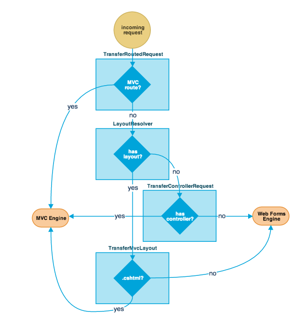

# Sitecore MVC

Sitecore's architecture is made modular and easily extensible through the use of many pipelines. The `web.config` defines which pipelines are used for which operation, and Sitecore transfers execution of an operation to the correspondent pipeline. Each pipeline, as the name suggests, contains a set of processors which are executed in sequence. Each processor contains a `Process()` method that accepts a single argument and returns nothing. A processor has the ability of aborting the pipeline, using the `AbortPipeline()` method, which makes sure that all the processors that follows the current one in that specific pipeline do not get called.

To use John West's words:

> Pipelines assist with **encapsulation**, **flexible configuration**, **separation of concerns**, **testability** and other objectives. Once you start implementing features with pipelines, you wonder how you ever configured enterprise systems without them.

*(to dig deeper and learn how to create and run your own custom pipelines in Sitecore, check out [this article](http://adeneys.wordpress.com/2008/08/27/creating-and-running-custom-pipelines-in-sitecore/) by Alistair Deneys)*

### The HttpRequestBegin Pipeline
*(for more details, read the in-depth article on the `HttpRequestBegin` pipeline on [InSitecore](http://insitecore.tumblr.com/post/37734162227/sitecore-httprequestbegin-pipeline-in-detail))*

This is the longest Sitecore pipeline, with over 20 processors being executed. It takes the incoming *http request* and determines how the request should be handled. 

#### Pipeline Execution

Before we dive into the specifics of each processors executed when this pipeline runs, let's try to understand what is triggering the execution of the pipeline itself in the first place. First, I simply tried searching for "HttpRequestBegin" within the Sitecore.Kernel code (decompiled from the Sitecore.Kernel DLL using [dotPeek](http://www.jetbrains.com/decompiler/) the free .NET decompiler from JetBrains), but I got no matches. This brought back to memory a comment by John West to [one of his own blog posts](http://www.sitecore.net/nederland/Community/Technical-Blogs/John-West-Sitecore-Blog/Posts/2011/05/Important-Pipelines-in-the-Sitecore-ASPNET-CMS.aspx), in which he stated that:

>some of the calls to pipelines are in obfuscated assemblies. One tip I can suggest is to add a processor to a pipeline and log the stack trace. 

Therefore I created this class:

```c#
namespace SCMVC72.Pipelines
{
    public class LogHttpRequestStackTrace : Sitecore.Pipelines.HttpRequest.HttpRequestProcessor
    {
        public string Pipeline { get; set; }
        public override void Process(HttpRequestArgs args)
        {
            StackTrace st = new StackTrace();
            Log.Info(string.Empty, this);
            Log.Info("*********************************************************************", this);
            Log.Info("LogHttpRequestStackTrace:", this);
            Log.Info("Pipeline" + Pipeline + "(" + args.RequestType + ")", this);
            Log.Info("Requested URL: " + Sitecore.Context.RawUrl, this);
            Log.Info("StackTrace:", this);
            Log.Info(st.ToString(), this);
            Log.Info("*********************************************************************", this);
        }
    }
}
```        

And I added this custom processor to the `HttpRequestBegin` by creating a configuration file in the `App_Config\Include` folder with the following:

```xml
  <configuration xmlns:patch="http://www.sitecore.net/xmlconfig/">
    <sitecore>
      <pipelines>
        <httpRequestBegin>
          <processor type="SCMVC72.Pipelines.LogHttpRequestStackTrace, SCMVC72"
                     patch:before="processor[@type='Sitecore.Pipelines.PreprocessRequest.CheckIgnoreFlag, Sitecore.Kernel']" />
        </httpRequestBegin>
      </pipelines>
    </sitecore>
  </configuration>    
```

I restarted the Sitecore site, hit the home page of the site and this is what I got in the logs:

```
4708 09:22:56 INFO  *********************************************************************
4708 09:22:56 INFO  LogHttpRequestStackTrace:
4708 09:22:56 INFO  Pipeline(Begin)
4708 09:22:56 INFO  Requested URL: /
4708 09:22:56 INFO  StackTrace:
4708 09:22:56 INFO     at SCMVC72.Pipelines.LogHttpRequestStackTrace.Process(HttpRequestArgs args)
   at (Object , Object[] )
   at Sitecore.Pipelines.CorePipeline.Run(PipelineArgs args)
   at Sitecore.Nexus.Web.HttpModule.(Object , EventArgs )
   at System.Web.HttpApplication.SyncEventExecutionStep.System.Web.HttpApplication.IExecutionStep.Execute()
   at System.Web.HttpApplication.ExecuteStep(IExecutionStep step, Boolean& completedSynchronously)
   at System.Web.HttpApplication.PipelineStepManager.ResumeSteps(Exception error)
   at System.Web.HttpApplication.BeginProcessRequestNotification(HttpContext context, AsyncCallback cb)
   at System.Web.HttpRuntime.ProcessRequestNotificationPrivate(IIS7WorkerRequest wr, HttpContext context)
   at System.Web.Hosting.PipelineRuntime.ProcessRequestNotificationHelper(IntPtr rootedObjectsPointer, IntPtr nativeRequestContext, IntPtr moduleData, Int32 flags)
   at System.Web.Hosting.PipelineRuntime.ProcessRequestNotification(IntPtr rootedObjectsPointer, IntPtr nativeRequestContext, IntPtr moduleData, Int32 flags)

4708 09:22:56 INFO  *********************************************************************
```

Needless to say, HRH John West was right. The stacktrace clearly shows that the pipeline is being run by an Http module defined in the  `Sitecore.Nexus` library. 

In case you are not familiar with Http modules, the .NET documentation states:

>An HTTP module is an assembly that is called on every request that is made to your application. HTTP modules are called as part of the ASP.NET request pipeline and have access to life-cycle events throughout the request. HTTP modules let you examine incoming and outgoing requests and take action based on the request.

In Sitecore's `web.config` we find the Nexus Http module added to the `<system.webServer>` section:

```
  <system.webServer>
    <modules runAllManagedModulesForAllRequests="true">
      <remove name="WebDAVModule"/>
      <add type="Sitecore.Web.RewriteModule, Sitecore.Kernel" name="SitecoreRewriteModule"/>
      <add type="Sitecore.Nexus.Web.HttpModule,Sitecore.Nexus" name="SitecoreHttpModule"/>
      <add type="Sitecore.Resources.Media.UploadWatcher, Sitecore.Kernel" name="SitecoreUploadWatcher"/>
```

Unfortunately, the `Sitecore.Nexus` DLL is obfuscated, therefore the decompiled code is hard to read. Nonetheless, if we try to decompile this DLL anyways, we find the following code, which is responsible for running the `HttpRequestBegin` Sitecore pipeline:

      string pipelineName1 = HttpModule.\u0080(1438);
      HttpRequestArgs httpRequestArgs = new HttpRequestArgs(context, HttpRequestType.End);
      CorePipeline.Run(pipelineName1, (PipelineArgs) httpRequestArgs);

To recap, on every incoming Http request, ASP.NET runs through a list of Http modules that need to be executed. One of the Http modules defined by the Sitecore's `web.config` is the `Sitecore.Nexus.Web.HttpModule`, which, among other things, runs the `HttpRequestBegin` pipeline.

#### Pipeline Processors

After a few diagnostic related processors, the pipeline fires up the `Site Resolver` processor, in charge of determining which *Sitecore site* (as per the site definitions inside the `configuration/sitecore/site` section of the `web.config`) should handle the incoming request and updated the `Sitecore.Context.Site` with this piece of information.

Next, the `UserResolver` processor is in charge of determining which Sitecore user sent the request. This processor will fill `Sitecore.Context.User` with the correct value (which can be *Anonymous*).

Next, the `DatabaseResolve` processor determines which database should be used by Sitecore to retrieve the items necessary to fulfill the incoming request. Then the `DeviceResolver` processor finds which Sitecore device should be used to handle the request.

After those processors are done, the `LanguageResolver` takes care of determining which language should be used to handle the request and saves the correct value in `Sitecore.Context.Language`.

Then a few processors take care of very specific type of requests, such as incoming requests for Sitecore media item, requests for specific Sitecore items (by using the `sc_itemid` query string parameter), Sitecore aliases and requests for physical files.

Next, the `ItemResolver` needs to determine which Sitecore item should be used to fulfill the request and saves its value in `Sitecore.Context.Item`.

Once the item has been determined, the `LayoutResolver` processor is in charge of determining which *Sitecore Layout* needs to be used to generate the response to be sent back. 

Finally, the last processor, called `ExecuteRequest`, does some last minute checks to make sure that the previous processors were able to resolve a *Sitecore site*, a *Sitecore item* and a valid *Sitecore layout* and, if all looks good, Sitecore updates the `HttpContext`'s path to point to the location of the physical file to execute.

### Sitecore MVC and the HttpBeginRequest Pipeline

If you followed up to this point, you might be wondering why are we diving so deep into the `HttpBeginRequest` pipeline. After all, most Sitecore developers probably never even need to open the hood of this pipeline during their daily development work. What is interesting for us, though, from a Sitecore MVC perspective, is the fact that Sitecore MVC added some important hooks in this pipeline.

First, right after the `ItemResolver`, Sitecore MVC inserts a new processor, the `TransferRoutedRequest`:

    <processor type="Sitecore.Mvc.Pipelines.HttpRequest.TransferRoutedRequest, Sitecore.Mvc" patch:after="processor[@type='Sitecore.Pipelines.HttpRequest.ItemResolver, Sitecore.Kernel']" />
    
This processor is in charge of redirecting to the Sitecore MVC rendering engine when an MVC route is matched (and aborting the pipeline).

Next, right after the `LayoutResolver`, Sitecore MVC hooks the new `TransferControllerRequest`:

    <processor type="Sitecore.Mvc.Pipelines.HttpRequest.TransferControllerRequest, Sitecore.Mvc" patch:after="processor[@type='Sitecore.Pipelines.HttpRequest.LayoutResolver, Sitecore.Kernel']" />
    
Every Sitecore item, since version 6.6, has two new fields, `Controller` and `Controller Action`, which can be utilized to tell Sitecore that, for a specific item, we want a custom MVC controller to be executed. The `TransferControllerRequest`, therefore, simply checks the content of the `Controller` field and, if it's not empty, it transfers control to it, aborting the pipeline.

Furthermore, right after the `LayoutResolver`, Sitecore MVC hooks a new processor, the `TransferMvcLayout` processor:

    <processor type="Sitecore.Mvc.Pipelines.HttpRequest.TransferMvcLayout, Sitecore.Mvc" patch:after="processor[@type='Sitecore.Pipelines.HttpRequest.LayoutResolver, Sitecore.Kernel']" />

This processor redirects to the Sitecore MVC rendering engine (aborting the pipeline) when the layout file is an MVC view (i.e. when the layout file has the `.cshtml` extension).

The following diagram summarizes the process followed by Sitecore in the `HttpBeginRequest` pipeline to determine which rendering engine needs to be used for the current incoming request.



*(To dig deeper, read the [MVC-related pipelines](mvc_with_sitecore/mvc_related_pipelines.md) chapter)*


### notes

"initialize" pipeline
runs the InitializeRoutes processor...
Sitecore.Mvc.Pipelines.Loader.InitializeRoutes.Process(PipelineArgs args)
calls...	
Sitecore.Mvc.Pipelines.Loader.InitializeRoutes.RegisterRoutes(RouteCollection routes, PipelineArgs args)
calls...
Sitecore.Mvc.Pipelines.Loader.InitializeRoutes.SetRouteHandlers(RouteCollection routes, PipelineArgs args)
creates new RouteHandlerWrapper 

Sitecore.Mvc.Routing.RouteHandlerWrapper.GetHttpHandler(RequestContext requestContext)
returns (IHttpHandler) new RouteHttpHandler

Sitecore.Mvc.Routing.RouteHttpHandler.ProcessRequest(HttpContext context)
calls
Sitecore.Mvc.Routing.RouteHttpHandler.BeginRequest()
runs 
"mvc.requestBegin" pipeline


An incoming request is handled by Sitecore MVC in the following manner: 

- Create a PageContext. 
 - mvc.requestBegin pipeline (see above how it's being called)

- Determine the requested item. 
 - the `PageContext` class contains a `GetItem()` method which runs the `mvc.getPageItem` pipeline
 

- Determine the relevant controller to invoke
 - Using the `SitecoreControllerFactory`, initialized during the `Initialize` pipeline
 - The `SitecoreControllerFactory` contains a method (`CreateSitecoreController`) which runs the `mvc.createController` pipeline
 - The `mvc.createController` pipeline checks if the item has a *custom controller* set in the `controller`/`controller action` fields. If not, it creates an instance of the `SitecoreController` class

- Build the PageDefinition and assign it to the PageContext. 

- Select the root rendering to use for generating the response (typically the layout assigned to 
the requested item). 

- Wrap an IView around the root rendering and store it in PageContext.PageView. 

- Pass the PageView to the ASP.NET MVC runtime for rendering the response to the client


        


